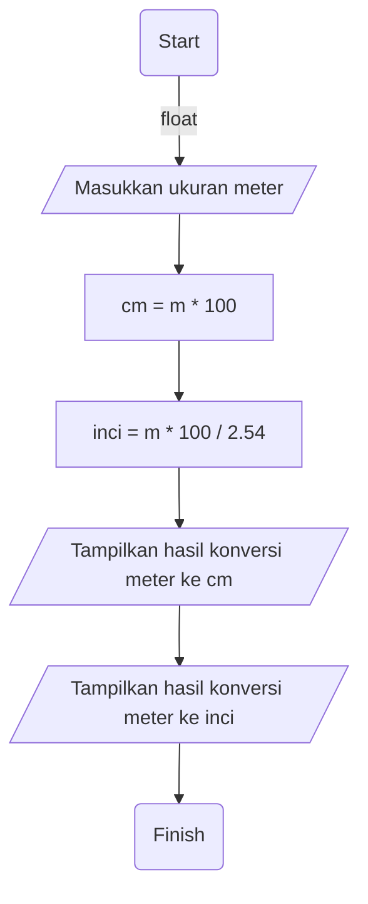

```mermaid
    flowchart TD;
    A(Start) --float--> B[/Masukkan ukuran meter/];
    B --> C[cm = m * 100]
    C --> D[inci = m * 100 / 2.54]
    D --> E[/Tampilkan hasil konversi meter ke cm/];
    E --> F[/Tampilkan hasil konversi meter ke inci/];
    F --> G(Finish);
```