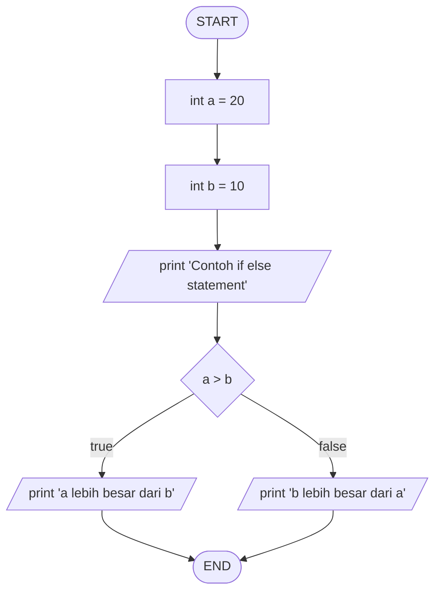

```mermaid
    flowchart TD;
    A([START]) --> B[int a = 20];
    B --> H[int b = 10];
    H --> G[/print 'Contoh if else statement'/]
    G --> C{a > b};
    C --true--> D[/print 'a lebih besar dari b'/];
    C --false--> E[/print 'b lebih besar dari a'/];
    D & E --> F([END]);
```