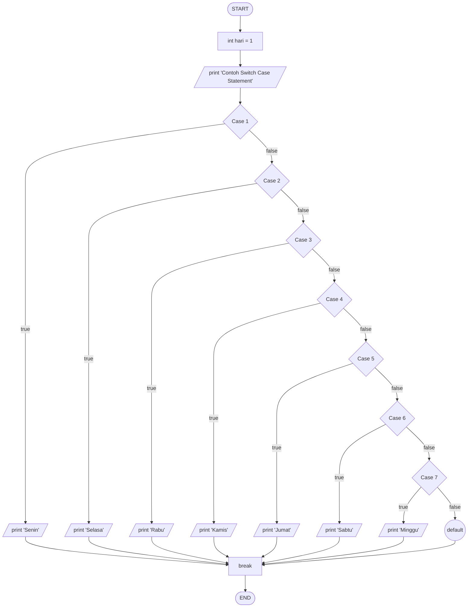

```mermaid
    flowchart TD;
    A([START]) --> B[int hari = 1];
    B --> C[/print 'Contoh Switch Case Statement'/];
    C --> D{Case 1};
    D --true--> K[/print 'Senin'/]
    D --false--> E{Case 2};
    E --true--> L[/print 'Selasa'/]
    E --false--> F{Case 3};
    F --true--> M[/print 'Rabu'/]
    F --false--> G{Case 4};
    G --true--> N[/print 'Kamis'/]
    G --false--> H{Case 5};
    H --true--> O[/print 'Jumat'/]
    H --false--> I{Case 6};
    I --true--> P[/print 'Sabtu'/]
    I --false--> J{Case 7};
    J --true--> Q[/print 'Minggu'/]
    J --false--> R((default));
    K & L & M & N & O & P & Q & R --> S[break];
    S --> T([END]);
```