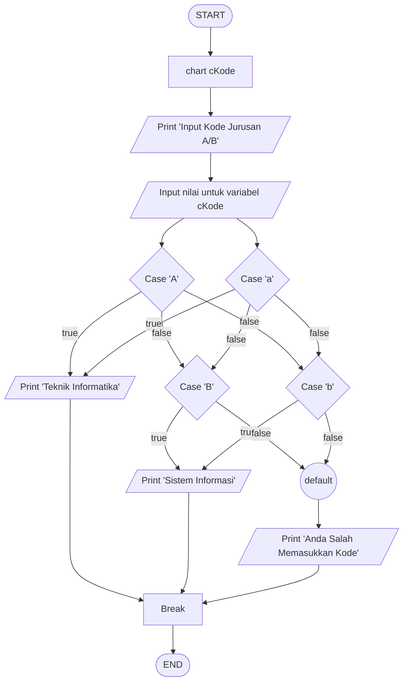

```mermaid
    flowchart TD;
    A([START]) --> B[chart cKode];
    B --> C[/Print 'Input Kode Jurusan A/B'/];
    C --> D[/Input nilai untuk variabel cKode/];
    D --> E{Case 'A'};
    D --> F{Case 'a'};
    E & F --true--> I[/Print 'Teknik Informatika'/];
    E & F --false--> G{Case 'B'};
    E & F --false--> H{Case 'b'};
    G & H --true--> J[/Print 'Sistem Informasi'/];
    G & H --false--> K((default));
    K --> L[/Print 'Anda Salah Memasukkan Kode'/];
    I & J & L --> M[Break];
    M --> N([END]);
```